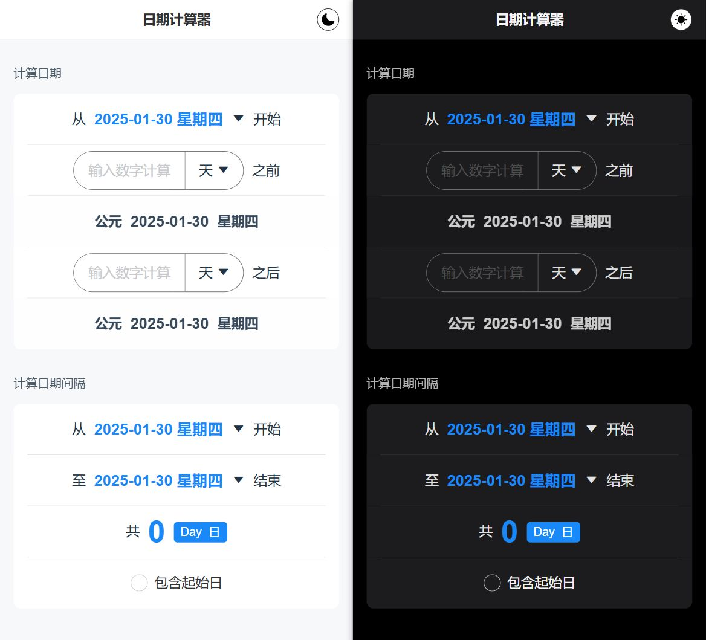

# Date Calculator

日期计算器，用于日期的计算，PC、Mobile 均适配，同时允许深浅模式的切换。

主要功能：

- 计算日期
- 计算日期间隔



## 技术栈

Vue3 + Vite + Pinia + VanUI

## run

```bash
# 克隆
$ git clone git@github.com:JhouXu/toolbox-date-calculator.git

# 进入项目目录
$ cd toolbox-date-calculator

# 安装依赖
$ npm install

# 运行
$ npm dev
```

## license

MIT

## other

- 部分 UI 样式参考 [Days Matter](https://apps.apple.com/cn/app/%E5%80%92%E6%95%B0%E6%97%A5-days-matter/id406170251)
- 图标来源 [阿里巴巴图标库 - 设计师付遥](https://www.iconfont.cn/collections/detail?cid=24251)
